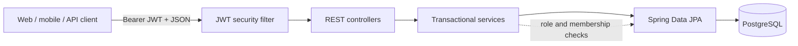

<div align="center">
  

  # Kronos API

  [](https://openjdk.org/projects/jdk/25/)
  [](https://spring.io/projects/spring-boot)
  [](https://www.postgresql.org/)
  [](https://docs.docker.com/compose/)
  [](https://www.openapis.org/)

  **A secure REST API for coordinating tasks, deadlines, and members across collaborative groups.**  
  Kronos gives schools and teams a single, role-aware source of truth while keeping its API contract discoverable and its runtime reproducible.
</div>

> [!NOTE]
> The current codebase is the source of truth for this document. Earlier product notes that reference Spring Boot 3.x or planned features have been superseded by the implementation described below.

## ✨ Key features

- **Stateless authentication** — registration and email-or-username login backed by Spring Security, BCrypt password hashing, and signed JWT bearer tokens.
- **Group-scoped authorization** — permissions are evaluated per group through `OWNER`, `ADMIN`, and `MEMBER` memberships instead of global user roles.
- **Complete task lifecycle** — create, list by group, update, and delete tasks with public UUIDs, deadline ordering, Jakarta Bean Validation, and role checks.
- **Collaborative workspaces** — create groups, join through normalized six-character invitation codes, list members, add users, update roles, and remove members.
- **Protected invitation data** — invitation codes are returned only to group owners and administrators.
- **Consistent error contracts** — centralized handling for conflicts (`400`), authentication (`401`), authorization (`403`), missing resources (`404`), validation (`422`), and unexpected failures (`500`).
- **Versioned persistence** — PostgreSQL schema changes are managed by Flyway while Hibernate validates the resulting schema at startup.
- **Live API documentation** — SpringDoc generates an OpenAPI 3 contract and an interactive Swagger UI with JWT authorization support.
- **Automated verification** — JUnit 5, Mockito, AssertJ, MockMvc, `@WebMvcTest`, and `ArgumentCaptor` cover business rules and HTTP behavior.
- **Container-first delivery** — a multi-stage Alpine build produces a minimal JRE image; Compose adds database health checks, persistent storage, and runtime hardening.

## 🧭 Architecture and design decisions

Kronos follows a **layered architecture**. HTTP concerns stay in controllers, application rules and authorization live in transactional services, and Spring Data repositories isolate persistence. Request and response DTOs keep the external contract separate from JPA entities.



```text
com.kronos.api
├── config/             # OpenAPI and application configuration
├── controller/         # REST endpoints and HTTP response mapping
├── dto/
│   ├── request/        # Validated inbound contracts
│   └── response/       # Safe outbound projections
├── infra/
│   ├── exception/      # Centralized API error handling
│   └── security/       # JWT filter, token service, and security chain
├── model/              # JPA entities and group-role enum
├── repository/         # Spring Data persistence interfaces
└── service/            # Transactions, authorization, and business rules
```

### Security model

| Capability | `OWNER` | `ADMIN` | `MEMBER` |
| --- | :---: | :---: | :---: |
| View group tasks and members | ✅ | ✅ | ✅ |
| Create, update, and delete tasks | ✅ | ✅ | — |
| Add or remove regular members | ✅ | ✅ | — |
| Promote or demote administrators | ✅ | — | — |
| View the invitation code | ✅ | ✅ | — |

JWTs carry identity, while the database remains authoritative for group membership and permissions. Public API paths use UUIDs; internal relational keys remain private.

### Why these choices?

- **Externalized configuration:** database credentials and JWT signing material come from environment variables. `.env` is ignored by Git, while `.env.example` documents the required contract without exposing secrets.
- **Flyway + JPA validation:** migrations evolve the schema deterministically; `ddl-auto: validate` prevents Hibernate from silently changing production data structures.
- **Multi-stage Docker build:** Maven and build tooling stay in the build stage. The runtime contains only the application JAR and Java 25 JRE, runs as UID `10001`, uses a read-only filesystem, drops Linux capabilities, and enables `no-new-privileges`.
- **Testing pyramid:** fast Mockito service tests form the base, focused MVC slice tests verify JSON and status contracts, and a Spring context smoke test catches wiring or configuration regressions.

## 📚 API documentation

With the application running, open:

- **Swagger UI:** [http://localhost:8080/swagger-ui.html](http://localhost:8080/swagger-ui.html)
- **OpenAPI JSON:** [http://localhost:8080/v3/api-docs](http://localhost:8080/v3/api-docs)

Use `POST /api/auth/login` to obtain a token, select **Authorize** in Swagger UI, and paste the token. SpringDoc configures the `Bearer` scheme automatically.

### Core API routes at a glance

| Method | Endpoint | Purpose | Access |
| --- | --- | --- | --- |
| `POST` | `/api/auth/register` | Create a global user account | Public |
| `POST` | `/api/auth/login` | Authenticate by email or username and issue a JWT | Public |
| `PATCH` | `/api/users/me` | Update the authenticated profile | Authenticated |
| `PATCH` | `/api/users/me/password` | Change the authenticated user's password | Authenticated |
| `POST` | `/api/groups` | Create a group and become its owner | Authenticated |
| `GET` | `/api/groups` | List the authenticated user's groups | Authenticated |
| `GET` | `/api/groups/{groupUuid}` | Get a group by its public UUID | Group member |
| `POST` | `/api/groups/join/{invitationCode}` | Join a group as a member | Authenticated |
| `GET` | `/api/groups/{groupUuid}/members` | List members ordered by role and name | Group member |
| `POST` | `/api/groups/{groupUuid}/members` | Add a user by email or username | Owner or admin |
| `PATCH` | `/api/groups/{groupUuid}/members/{userUuid}/role` | Promote or demote a member | Owner |
| `DELETE` | `/api/groups/{groupUuid}/members/{userUuid}` | Remove a group member | Owner or admin |
| `POST` | `/api/tasks` | Create a task | Owner or admin |
| `GET` | `/api/tasks/group/{groupUuid}` | List tasks ordered by nearest deadline | Group member |
| `PUT` | `/api/tasks/{taskUuid}` | Replace mutable task fields | Owner or admin |
| `DELETE` | `/api/tasks/{taskUuid}` | Delete a task | Owner or admin |

## 🚀 Running locally

### Prerequisites

Choose the workflow that fits your environment:

- **Docker workflow:** Docker Engine or Docker Desktop with Compose v2. No host JDK or Maven installation is required.
- **Maven workflow and tests:** **JDK 25**. Maven is provided through the repository wrapper.

> [!IMPORTANT]
> Although Spring Boot 4 has a Java 17 baseline, this project explicitly compiles with `<java.version>25</java.version>`. JDK 17 cannot build this repository; use JDK 25 or run the Docker workflow.

### 1. Configure the environment

Create a local `.env` from the committed template:

```bash
cp .env.example .env
```

```powershell
Copy-Item .env.example .env
```

Before starting the stack, replace the `change-me` values in `.env`. In particular, set `POSTGRES_PASSWORD` to a long random password and `API_SECURITY_TOKEN_SECRET` to at least 32 cryptographically random bytes.

```bash
openssl rand -base64 32
```

| Variable | Purpose | Default |
| --- | --- | --- |
| `KRONOS_API_PORT` | Host port mapped to the API | `8080` |
| `POSTGRES_DB` | PostgreSQL database name | `kronos_db` |
| `POSTGRES_USER` | Database user | Required |
| `POSTGRES_PASSWORD` | Database password | Required |
| `API_SECURITY_TOKEN_SECRET` | HMAC key used to sign and verify JWTs | Required |
| `API_SECURITY_TOKEN_ISSUER` | Expected JWT issuer | `kronos-api` |
| `API_SECURITY_TOKEN_EXPIRATION_HOURS` | Token lifetime in hours | `2` |

> [!CAUTION]
> Never commit `.env`, real credentials, or production signing keys. The repository's `.gitignore` already excludes `.env` files except for `.env.example`.

### 2. Start the API and PostgreSQL

```bash
docker compose up --build -d
```

The API waits for PostgreSQL's health check before starting. Flyway then applies the versioned migrations, and Hibernate validates the schema.

Check container state or follow application logs:

```bash
docker compose ps
docker compose logs -f kronos-api
```

### 3. Access the application

| Resource | URL |
| --- | --- |
| REST API | `http://localhost:8080` |
| Swagger UI | `http://localhost:8080/swagger-ui.html` |
| OpenAPI contract | `http://localhost:8080/v3/api-docs` |

Create the first account with a concrete request:

```bash
curl --request POST http://localhost:8080/api/auth/register \
  --header "Content-Type: application/json" \
  --data '{
    "name": "Alex Smith",
    "email": "alex.smith@example.com",
    "username": "alex.smith",
    "password": "KronosDemo2026!"
  }'
```

Then authenticate using **either** `email` or `username`:

```bash
curl --request POST http://localhost:8080/api/auth/login \
  --header "Content-Type: application/json" \
  --data '{
    "email": "alex.smith@example.com",
    "password": "KronosDemo2026!"
  }'
```

The response includes `token`, `tokenType`, and the authenticated user projection. Send protected requests with `Authorization: Bearer <token>`.

PostgreSQL data is stored in the named volume `kronos-postgres-data`, so normal container recreation does not erase the database.

## 🧪 Running tests

The test context also initializes `TokenService`, so provide a non-production JWT secret in the current shell. Maven does not load `.env` automatically.

On Linux or macOS:

```bash
export API_SECURITY_TOKEN_SECRET="kronos-test-secret-at-least-32-bytes"
./mvnw test
```

On Windows PowerShell:

```powershell
$env:API_SECURITY_TOKEN_SECRET = "kronos-test-secret-at-least-32-bytes"
.\mvnw.cmd test
```

For the full Maven verification lifecycle:

```bash
./mvnw clean verify
```

The suite is organized by responsibility:

- **Unit tests:** Mockito isolates repositories while AssertJ verifies service outcomes, permission failures, normalization, and persistence interactions. `ArgumentCaptor` inspects the exact entity sent to the repository.
- **MVC slice tests:** `@WebMvcTest` and MockMvc exercise request deserialization, validation, delegated calls, JSON responses, and HTTP statuses such as `201`, `204`, `403`, `404`, and `422`.
- **Context smoke test:** `@SpringBootTest` boots the application with an H2 database in PostgreSQL compatibility mode to detect broken wiring.

The philosophy is behavior-first coverage: each happy path is paired with boundary cases such as unknown resources, invalid payloads, missing memberships, and insufficient roles. The centralized error contract separately maps database conflicts to `400` and missing entities to `404`, keeping failures predictable for API consumers.

---

<div align="center">
  Built for teams that would rather manage deadlines than rediscover them.
</div>
